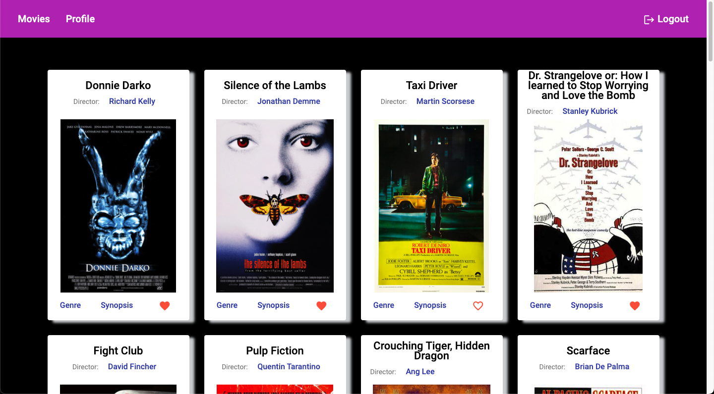
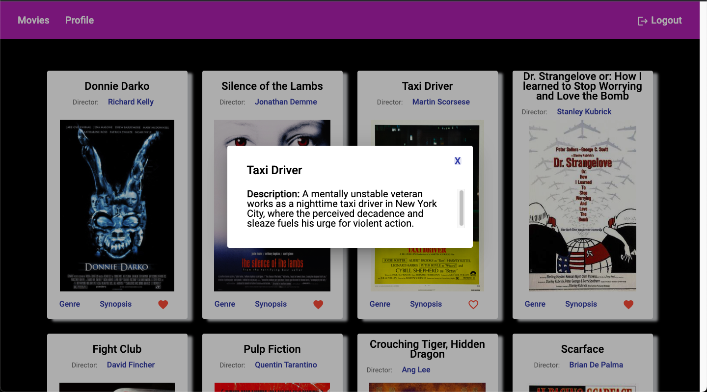

# MyFlix-Angular-client

## Images

  
  

## Description

This single-page, responsive application (SPA) is the client-side for an application called myFlix ([see the repository]) based on its existing server-side code (REST API and database), with supporting documentation. It features routing, rich interactions, several interface views, and a polished user experience.

Structure of components:

- Welcome screen
  - User registration
  - User login
- Navbar
- Movie Card View
- Dialogs for Movie Card
  - Director
  - Genre
  - Synopsis
- Profile View

### User Stories

- As a user, I want to be able to receive information on movies, directors, and genres so that I can learn more about movies I’ve watched or am interested in.
- As a user, I want to be able to create a profile so I can save data about my favorite movies.

## 🔨 Technologies

- TypeScript, SCSS, HTML
- Angular
- Node.js
- [Angular Material](https://material.angular.io/)
- Documentation [TypeDoc](https://typedoc.org/)

## General remarks

This project was generated with [Angular CLI](https://github.com/angular/angular-cli) version 13.3.5.

### Development server

Run `ng serve` for a dev server. Navigate to `http://localhost:4200/`. The application will automatically reload if you change any of the source files.

### Code scaffolding

Run `ng generate component component-name` to generate a new component. You can also use `ng generate directive|pipe|service|class|guard|interface|enum|module`.

### Build

Run `ng build` to build the project. The build artifacts will be stored in the `dist/` directory.

### Running unit tests

Run `ng test` to execute the unit tests via [Karma](https://karma-runner.github.io).

### Running end-to-end tests

Run `ng e2e` to execute the end-to-end tests via a platform of your choice. To use this command, you need to first add a package that implements end-to-end testing capabilities.

### Deploy to gh-pages

Run `ng deploy --base-href=/myFlix-Angular-client/`

### Further help

To get more help on the Angular CLI use `ng help` or go check out the [Angular CLI Overview and Command Reference](https://angular.io/cli) page.

## 🌱 Live Demo

Check it out [here](https://decisivehoneybadger.github.io/myFlix-Angular-client/)
